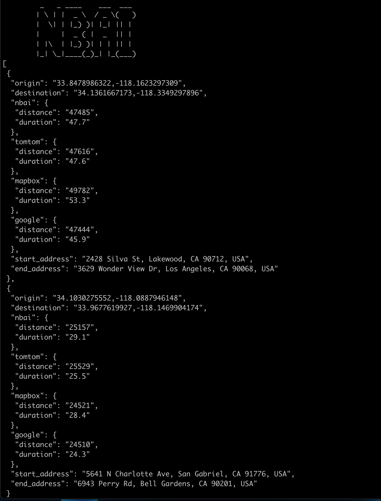
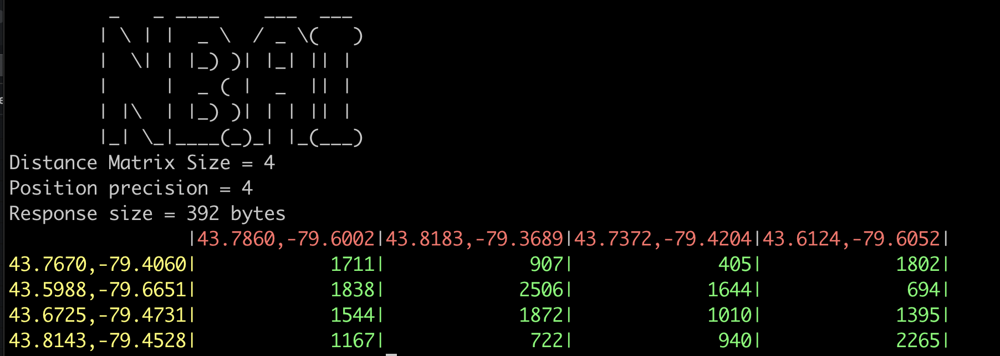

# API documentation
[https://doc.maps.nextbillion.io/api_reference/]

# Directions

## Description
Utility used to perform route result comparisons (distance/duration) across different service providers.
- random set of lat/lon pairs within a defined area-of-interest
- define number of routes to compare
- output is comparison of results from NBAI, TomTom, Google, and Mapbox

## Quick Start
- `npm install`
- modify the `.env` file for
  - entries API_HOST (http://localhost:9999 or https://api.nextbillion.io) 
  - API_KEY (your assigned key)
  - AREA_OF_INTEREST (based on geojson files in `data` folder - atlanta, bangalore, la, london, newyork, ohio, ontario, sf, south yorkshire, texas currently)
  - keys required for other service providers - TomTom, Google, and Mapbox
- alter the number of routes to be compared in the constant defined in `directions/compare.js`
- `node directions/compare.js --aoi la`

# Distance Matrix

## Description
Javascript/node.js example of Nextbillion.ai travel/distance matrix calculation API using Flatbuffer, Protobuf, and JSON endpoints. 
- random set of lat/lon pairs within a defined polygon
- default size of grid is 8 x 8
- `.env` file is read to determine endpoint, key, area of interest
- command line parameters allow user to set area-of-interest, number of origins, and number of destinations

## Quick Start
- install Flatbuffers `brew install flatbuffer`
- install Protobuf `brew install protobuf`
- install TypeScript transpiler `brew install tsc`
- compile the nextbillion.ai schema to generate TypeScript files `flatc -o build/gen --ts nbai_fbschema.fbs`
- compile the protobuf definition to JavaScript `protoc --proto_path=. --js_out=library=nbai_pb/matrix,binary:build/gen  nbai_protos.proto`
- `npm install`
- transpile TS to JS `tsc build/gen/nbai_fb/*.ts`
- modify the `.env` file for 
  - entries API_HOST (http://localhost:9999 or https://api.nextbillion.io) 
  - API_KEY (your assigned key)
  - AREA_OF_INTEREST (based on geojson files in `data` folder - la, london, ontario, south yorkshire currently)
- Usage: `node distancematrix/distmatrix.json --format json --origins {int} --destinations {int} --aoi atlanta|bangalore|dallas|la|london|newyork|ohio|ontario|southyorkshire`
- output to console is the time distance grid and the size of the response

## Questions
jim.welch@nextbillion.ai