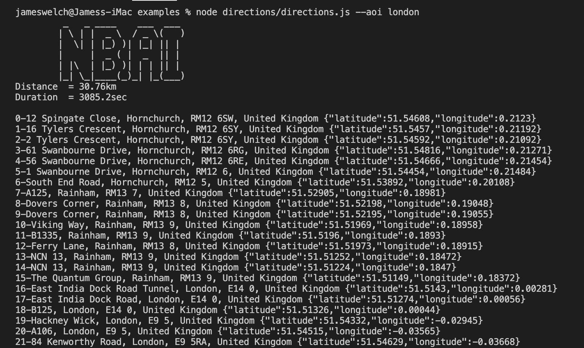

# API documentation
[https://doc.maps.nextbillion.io/api_reference/]

# Directions

## Description
Utility used to test ETA, distance, and reverse geocoding
- random origin/destination pair within a defined area-of-interest
- show the route distance and duration
- use reverse geocoding service to describe the route maneuver locations

## Quick Start
- `npm install`
- modify the `.env` file for
  - entries API_HOST (http://localhost:9999 or https://api.nextbillion.io) 
  - API_KEY (your assigned key)
  - AREA_OF_INTEREST (based on geojson files in `data` folder - atlanta, bangalore, la, london, newyork, ohio, ontario, sf, south yorkshire, texas currently)
- alter the number of routes to be compared in the constant defined in `directions/compare.js`
- `node directions/directions.js --aoi la`

# Routing Compare

## Description
Utility used to perform route result comparisons (distance/duration) across different service providers.
- random set of lat/lon pairs within a defined area-of-interest
- define number of routes to compare
- output is comparison of results from NBAI, TomTom, Google, and Mapbox

## Quick Start
- `npm install`
- modify the `.env` file for
  - entries API_HOST (http://localhost:9999 or https://api.nextbillion.io) 
  - API_KEY (your assigned key)
  - AREA_OF_INTEREST (based on geojson files in `data` folder - atlanta, bangalore, la, london, newyork, ohio, ontario, sf, south yorkshire, texas currently)
  - keys required for other service providers - TomTom, Google, and Mapbox
- alter the number of routes to be compared in the constant defined in `directions/compare.js`
- `node directions/compare.js --aoi la`
  
# Distance Matrix

## Description
Javascript/node.js example of Nextbillion.ai travel/distance matrix calculation API using Flatbuffer, Protobuf, and JSON endpoints. 
- random set of lat/lon pairs within a defined polygon
- default size of grid is 8 x 8
- `.env` file is read to determine endpoint, key, area of interest
- command line parameters allow user to set area-of-interest, number of origins, and number of destinations

## Quick Start
- install Flatbuffers `brew install flatbuffer`
- install Protobuf `brew install protobuf`
- install TypeScript transpiler `brew install tsc`
- compile the nextbillion.ai schema to generate TypeScript files `flatc -o build/gen --ts nbai_fbschema.fbs`
- compile the protobuf definition to JavaScript `protoc --proto_path=. --js_out=library=nbai_pb/matrix,binary:build/gen  nbai_protos.proto`
- `npm install`
- transpile TS to JS `tsc build/gen/nbai_fb/*.ts`
- modify the `.env` file for 
  - entries API_HOST (http://localhost:9999 or https://api.nextbillion.io) 
  - API_KEY (your assigned key)
  - AREA_OF_INTEREST (based on geojson files in `data` folder - la, london, ontario, south yorkshire currently)
- Usage: `node distancematrix/distmatrix.json --format json --origins {int} --destinations {int} --aoi atlanta|bangalore|dallas|la|london|newyork|ohio|ontario|southyorkshire`
- output to console is the time distance grid and the size of the response

# Testing

## Option 1: Simple Test Runner (No Installation Required)

The simplest way to run tests is using the built-in test runner:

```bash
node directions/__tests__/run-tests.js
```

This will run all tests and show results immediately.

## Option 2: Full Jest Setup (Recommended for Development)

### Step 1: Install Dependencies
```bash
npm install
```

If that doesn't work, try installing Jest directly:
```bash
npm install jest --save-dev
```

### Step 2: Run Tests
```bash
npm test
```

### Step 3: Run with Coverage
```bash
npm run test:coverage
```

## Option 3: Manual Jest Installation

If you're having issues with npm, you can install Jest globally:

```bash
npm install -g jest
jest
```

## Troubleshooting

### "jest: command not found"
This means Jest isn't installed. Try:
```bash
npm install jest --save-dev
```

### "npm install" hangs
Try clearing npm cache:
```bash
npm cache clean --force
npm install
```

### Permission issues
On macOS/Linux, you might need:
```bash
sudo npm install
```

## Test Results

You should see output like this:

```
🧪 Running Directions Module Tests

✅ parseArguments should return parsed arguments
✅ loadPolygonData should load polygon data successfully
✅ loadPolygonData should throw error for invalid area
✅ generateRandomPoints should generate correct number of points
✅ formatCoordinates should format coordinates with specified precision
✅ processRouteData should process route data and return steps
✅ reverseGeocode should return geocoded address information
✅ displayManeuvers should display maneuver information correctly
✅ Integration: Complete workflow should work end-to-end

📊 Test Summary
Total Tests: 9
Passed: 9
Failed: 0
Success Rate: 100.0%

🎉 All tests passed!
```

## What's Tested

The test suite covers:
- ✅ Command line argument parsing
- ✅ Polygon data loading with error handling
- ✅ Random point generation
- ✅ Coordinate formatting
- ✅ API route data fetching
- ✅ Route data processing
- ✅ Reverse geocoding
- ✅ Maneuver display
- ✅ Complete workflow integration
- ✅ Route comparison functionality
- ✅ Distance matrix operations

## Next Steps

1. **Start with Option 1** to see tests working immediately
2. **Use Option 2** for full development workflow
3. **Extend tests** for other modules as needed

## Questions
jim.welch@nextbillion.ai